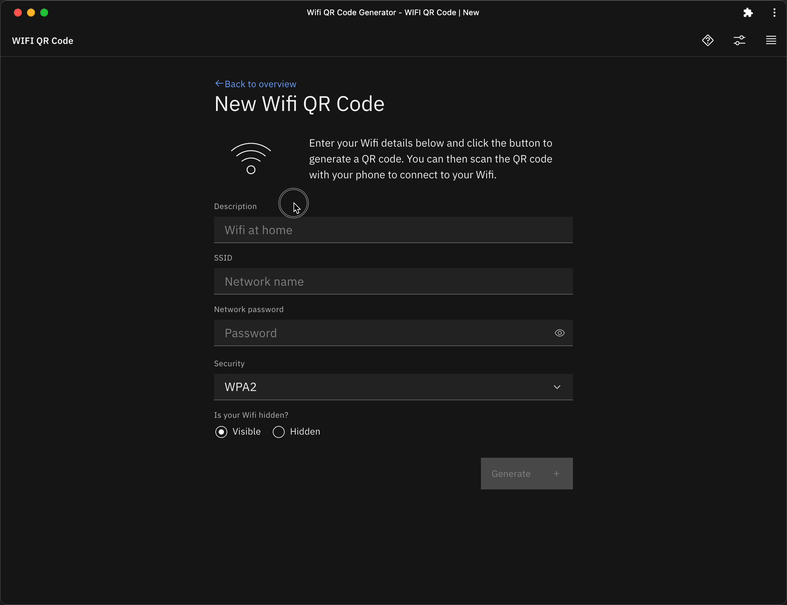

# Wifi QR code generator

Easily share you Wifi with friends and family via QR codes. This is
mainly a learning project to get deeper into SvelteKit and explore
a few libraries within the ecosystem. I'm happy to hear any feedback!

[Available at wifi-qr-co.de/](https://wifi-qr-co.de/)
[ProductHunt launch page](https://www.producthunt.com/posts/wifi-qr-code)

## Links

- [Changelog](./CHANGELOG.md)
- [License: MIT](./LICENSE)

## Libraries used

- [SvelteKit](https://kit.svelte.dev)
- [soldair/node-qrcode](https://github.com/soldair/node-qrcode)
- [IBM/carbon-components-svelte](https://github.com/IBM/carbon-components-svelte)
- [IBM/cabon-icons-svelte](https://github.com/IBM/carbon-icons-svelte)
- [IBM/carbon-pictograms-svelte](https://github.com/IBM/carbon-pictograms-svelte)
- [@vite-pwa/sveltekit / vite-plugin-pwa](https://vite-pwa-org.netlify.app/frameworks/sveltekit.html)
